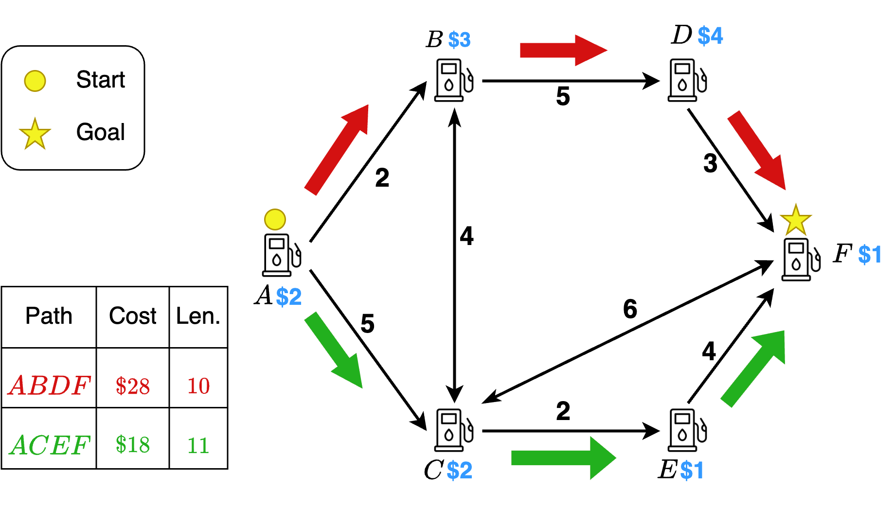

# Refuel A* (RF-A*)
This work addresses the Path Finding with Refuelling (PF-RF) problem, where the main objective is to find a minimum cost of refuelling path from the start to the goal while ensuring that the robot does not cross a specified limit on the number of stops made.
This repo provides a C++ implementation of Refuel A\* (RF-A\*) Algorithm, which is guaranteed to find an optimal solution path.

The code is distributed for academic and non-commercial use.
THE SOFTWARE IS PROVIDED "AS IS", WITHOUT WARRANTY OF ANY KIND, EXPRESS OR
IMPLIED, INCLUDING BUT NOT LIMITED TO THE WARRANTIES OF MERCHANTABILITY,
FITNESS FOR A PARTICULAR PURPOSE AND NONINFRINGEMENT. IN NO EVENT SHALL THE
AUTHORS OR COPYRIGHT HOLDERS BE LIABLE FOR ANY CLAIM, DAMAGES OR OTHER
LIABILITY, WHETHER IN AN ACTION OF CONTRACT, TORT OR OTHERWISE, ARISING FROM,
OUT OF OR IN CONNECTION WITH THE SOFTWARE OR THE USE OR OTHER DEALINGS IN THE
SOFTWARE.


<p align="center">
    
    <p align="center">(Fig 1: Example of PF-RF. The minimum-cost path is ACEF, and the minimum fuel consumption path is ABDF.)</p>
</p>

## Requirements

* We use CMake (3.16.3) and Make (4.2.1) to compile the code. Lower or higher version may also work.
* Optional:
    * Gurobi Academic Version

## Project Structure

* `README.md` - This file
* `source/` - Contains the path planning source code
* `program/` - Contains example code for path planning algorithms
* `include/` - Contains header files
* `small-data/` - Contains sample graph files
* `city-data/` - Contains city graph files for experiment

## Instructions:

### Installation

* Clone this repo
* Install Gurobi C++ library(optional)
    * create a folder to store Gurobi header and library: `mkdir gurobi_dir`
    * [download version 10](https://www.gurobi.com/downloads/gurobi-software/)
    * extract all resources from the downloaded package and store in `gurobi_dir`
    * the structure of `gurobi_dir` must be:
    ```
        gurobi_dir
        ├── bin/
        ├── docs/
        ├── EULA.pdf
        ├── examples/
        ├── include/
        ├── lib/
        ├── matlab/
        ├── R/
        ├── ReleaseNotes.html
        ├── setup.py
        └── src/
    ```
* Compile this repo
    * `make fast`: compile the project using `-DCMAKE_BUILD_TYPE=release` flag
    * `make dev`: compile the project using `-DCMAKE_BUILD_TYPE=debug` flag

**Notice:** For user who haven't installed `Gurobi C++`, the build process will report a compilation error.
    Users can simply ignore this error, as the other executables (`dp,run_refill`) can still be successfully compiled.


### Command-Line Interface (CLI)

* Run example via command-line interface (CLI)
    * TL,DR: 
        * `./build/dp ./small-data/graph_data.csv 5 1 3 8`, or;
        * `./build/run_refill ./city-data/Phil_gas.csv 58 39 10 60000`
    * All commands are in format `<exec> <map> <start> <target> <K> <Q>`, where:
        * `<expr>` are one of solver: 
            * `./build/dp`: the Dynamic Programming method
            * `./build/run_refill`: `ERCA*`, the proposed method
            * `./build/mip-gurobi`: the MIP model by Gurobi solver (optional)
        * `<map>` map files in `./small-data` or `./city-data`
        * `<start>, <target>`: vertex id of start and target location
        * `<K>`: max number of stops
        * `<Q>`: max capacity of tank

### Run experiments
* `python gen_expr.py`: generate instances for experiments, generated instances are stored in `city-data/` and `syn-data/`
* `run_expr.py` run multiple instances and save result in `./output`
    * `./run_expr.py syn-small`: run experiment on all small maps in `./syn-data` (`8.csv, 16.csv, 32.csv`)
        * `./run_expr.py syn-small 0`: the same as above but excluding `mip-gurobi` 
    * `./run_expr.py syn-large`: run experiment on all large maps in `./syn-data` (`256.csv, 512.csv, 1024.csv`)
    * `./run_expr.py small`: run experiment on small maps in `./small-data`
        * `./run_expr.py small 0`: the same as above but excluding `mip-gurobi`
    * `./run_expr.py city`: run experiment on all maps in `./city-data`
* `./validator.py output`: validate all result in `./output`

### Graph file specification
The graph files are all `.csv` files which were constructed usign the OpenStreetMap dataset queried using `osmnx` library in python. The files have the following columns: `Gas_node_from` (Station ID of the gas node we are travelling from as in the OpenStreetMap), `Gas_node_to` (station ID of the gas node we are travelling to as in OpenStreetMap), `distance` (in meters), `cost` (the cost of refuelling 1 unit of gas at that station), `index_from` and `index_to` (for ease of indexing to store the graph data in our graph datastructure).

### Result file specification

Result file contains multiple columns of metadata in two categories: 
* Problem input:
    * `map s t K Q alg` 
* Result
    * `best`: best objective found by the solver
    * `size`: number of states have been visited
    * `runtime`: elapsed time in micro second (us) to find solution (exclude initialization)
* Example:
    ```csv
   map,s,t,K,Q,algo,best,size,runtime
   Phil_gas,58,39,10,60000,erca,2237892,1016,1.326e+04
   Phil_gas,39,58,10,60000,erca,2134697,539,1.294e+04
   Phil_gas,58,39,10,60000,dp,2237892,1334182,7.732e+04
   Phil_gas,39,58,10,60000,dp,2134697,1369647,7.743e+04
    ```
## Cite
If you found this work useful, please consider citing:
```
@ARTICLE{10879573,
  author={Zhao, Shizhe and Nandy, Anushtup and Choset, Howie and Rathinam, Sivakumar and Ren, Zhongqiang},
  journal={IEEE Robotics and Automation Letters}, 
  title={Heuristic Search for Path Finding with Refuelling}, 
  year={2025},
  volume={},
  number={},
  pages={1-8},
  keywords={Fuels;Costs;Urban areas;Electronic mail;Dynamic programming;Robot kinematics;Mathematical programming;Autonomous aerial vehicles;Training;Runtime;Motion and Path Planning;Scheduling and Coordination;Robotics in Under-Resourced Settings},
  doi={10.1109/LRA.2025.3540736}}
```
